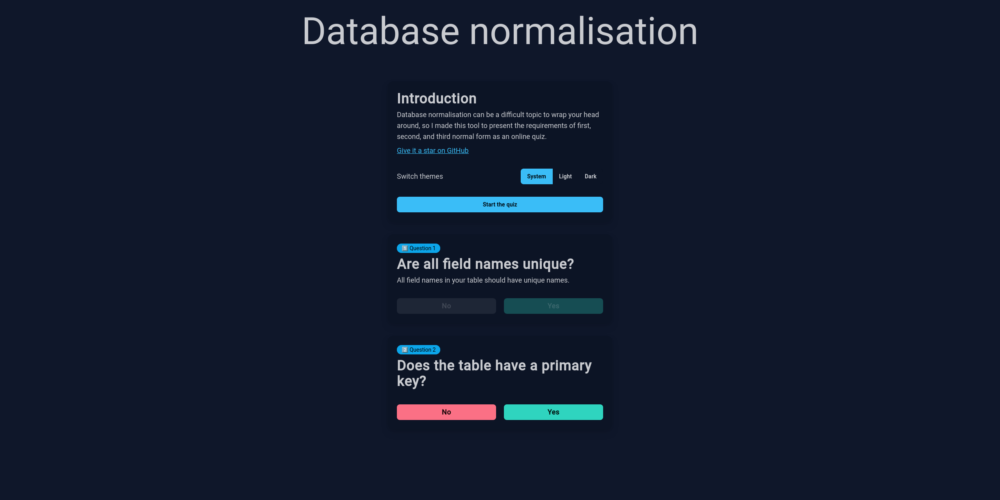

# 🍱 Normal web app

- A-Level Computer Science revision
- You like databases?
- We've got stuff about the first normal form
- Second and third normal forms, too!

## Try it out

- Go to **<https://normal-form.slevel.xyz>** (recommended)
- Alternatively, go to <https://db-normal-form.netlify.app/>
- Alternatively alternatively, go to <https://normal-form.mmk21.xyz/>

## What is it?

A web app made for A-Level Computer Science revision. It asks you questions about your database design and tells you if it meets the requirements for being in first normal form, second normal form, or third normal form.

## Screenshots

## Development instructions

We use TypeScript, Vite, Yarn Berry, Tailwind CSS, daisyUI, and Voby.

To get started with development, clone the repository, install dependencies by running `yarn`, and then run `yarn dev` to start the development server.

## Deployment instructions

Run `yarn build` to build a production version of the site to the `dist` directory.

The main instance is deployed on [Netlify](http://netlify.com/)'s free tier.

## Contact

Feel free to contact me ([@RandomSearch18](https://github.com/RandomSearch18/)) if you have any questions about the project!
